# Route Scheduling Architecture
## Go Happy Cab - Time Management & Non-School Day System

**Date:** December 1, 2025
**Purpose:** Document how school schedules, non-school days, and early release times flow from data import through to Driver App route cards

---

## Current System Flow

```mermaid
flowchart TD
    subgraph "DATA SOURCES"
        GS1[📊 Google Sheet<br/>Schools & Contacts]
        GS2[📊 Google Sheet<br/>Non School Days 2025/26]
        GS3[📊 Google Sheet<br/>School Schedules]
    end

    subgraph "CONVEX TABLES"
        SCH[🏫 schools]
        SCHED[⏰ schoolSchedules]
        NSD[📅 nonSchoolDays]
        CH[👶 children]
        RT[🚗 routes]
    end

    subgraph "DISPATCH APP"
        DA_CREATE[Create Route Pairing]
        DA_WARN[⚠️ Non-School Day Warning]
        DA_TIME[Set Scheduled Time]
    end

    subgraph "DRIVER APP"
        DR_QUERY[Query Routes for Today]
        DR_CARD[Route Card Display]
        DR_TIME[Show Pickup/Dropoff Time]
        DR_ALERT[Non-School Day Alert]
    end

    GS1 -->|importSchools| SCH
    GS3 -->|importSchoolSchedules| SCHED
    GS2 -->|upsertNonSchoolDays| NSD

    SCH --> DA_CREATE
    SCHED --> DA_TIME
    NSD --> DA_WARN

    DA_CREATE --> RT
    DA_TIME --> RT

    RT --> DR_QUERY
    DR_QUERY --> DR_CARD
    DR_CARD --> DR_TIME
    NSD -.->|❌ NOT IMPLEMENTED| DR_ALERT
```



---

## Convex Tables of Interest

### 1. `schools` - School Master Data
```
Fields:
- schoolName: string (e.g., "Bacich Elementary School")
- districtId: Id<"districts">
- streetAddress, city, state, zip
- officePhone
- firstDay, lastDay (school year dates)

Index: by_school_name
```

### 2. `schoolSchedules` - Daily Timing
```
Fields:
- schoolId: Id<"schools">
- amStartTime: string (e.g., "8:45 AM")
- pmReleaseTime: string (e.g., "3:15 PM")
- minDayDismissalTime: optional string (e.g., "12:30 PM")
- minimumDays: optional string (e.g., "Varies", "Friday")
- earlyRelease: optional string (e.g., "Every Wed 2:00 PM")
- pmAftercare: optional string

Index: by_school
```

### 3. `nonSchoolDays` - School Closures
```
Fields:
- schoolId: Id<"schools">
- date: string (YYYY-MM-DD)
- description: optional string (e.g., "Winter Break")

Indexes: by_school, by_date, by_school_date
```

### 4. `children` - Child Time Data
```
Relevant Time Fields:
- pickupTime: optional string (e.g., "8:30 AM")
- classStartTime: optional string (e.g., "9:00 AM")
- classEndTime: optional string (e.g., "3:20 PM")
- schoolName: string (for lookup)
- schoolId: optional string
```

### 5. `routes` - Route Assignments
```
Relevant Fields:
- date: string (YYYY-MM-DD)
- period: "AM" | "PM"
- childId: Id<"children">
- driverId: Id<"drivers">
- scheduledTime: optional string (e.g., "8:30 AM")
- status: "assigned" | "completed" | "no_show" | etc.
```

---

## Current Implementation Status

### ✅ IMPLEMENTED

| Feature | Location | Status |
|---------|----------|--------|
| School data import | `schools.ts:importSchools` | ✅ Working |
| School schedules import | `schools.ts:importSchoolSchedules` | ✅ Working |
| Non-school days import | `schools.ts:upsertNonSchoolDays` | ✅ Working + Fuzzy matching |
| Query routes by driver/date | `assignments.ts:getForDate` | ✅ Working |
| Route creation with scheduled time | `assignments.ts:create` | ✅ Working |
| Directory shows school schedules | `directory.ts:getSchoolsWithContacts` | ✅ Working |

### ❌ GAPS - NOT YET IMPLEMENTED

| Feature | Impact | Priority |
|---------|--------|----------|
| **Non-school day check on route creation** | Dispatch can accidentally create routes on school holidays | 🔴 HIGH |
| **Non-school day warning on route cards** | Driver doesn't know if school is closed | 🔴 HIGH |
| **Early release time adjustment** | PM routes show regular time instead of early dismissal | 🟡 MEDIUM |
| **Minimum day time adjustment** | PM routes show wrong time on min days | 🟡 MEDIUM |
| **School schedule lookup for child** | Time defaults to child record, not school schedule | 🟡 MEDIUM |
| **Early Out Days table** | No dedicated table for early release dates | 🟡 MEDIUM |

---

## Recommended Architecture

### Phase 1: Non-School Day Blocking (HIGH PRIORITY)


**Implementation:**
1. Add `checkNonSchoolDay` query to `schools.ts`
2. Call from `assignments.create` mutation
3. Return error with description if date is non-school day

### Phase 2: Time Adjustment Logic


### Phase 3: New Table - `earlyOutDays`

Currently, the `schoolSchedules.earlyRelease` field is a string like "Every Wed 2:00 PM" - this isn't queryable by date. We need a separate table:

```typescript
// Proposed schema addition
earlyOutDays: defineTable({
    schoolId: v.id("schools"),
    date: v.string(), // YYYY-MM-DD
    dismissalTime: v.string(), // e.g., "12:30 PM"
    reason: v.optional(v.string()), // e.g., "Staff Development"
})
    .index("by_school", ["schoolId"])
    .index("by_date", ["date"])
    .index("by_school_date", ["schoolId", "date"]),
```

---

## Data Entry Required

### For Complete Time Management:

1. **Non-School Days** ✅ (December imported)
   - Import remaining months from "Non School Days 2025/26" sheet
   - Use existing `upsertNonSchoolDays` mutation with fuzzy matching

2. **School Schedules**
   - Verify all schools have `amStartTime` and `pmReleaseTime`
   - Populate `minDayDismissalTime` where applicable
   - Check Convex Dashboard: `schoolSchedules` table

3. **Early Out Days** (NEW TABLE NEEDED)
   - Create list of specific early dismissal dates per school
   - Include dismissal time for each date
   - This requires a new Google Sheet or manual entry

### Convex Dashboard Direct Entry

You can enter data directly at:
**https://dashboard.convex.dev/t/colorful-wildcat-524**

Tables to populate:
- `schoolSchedules` - Add `minDayDismissalTime` for schools with minimum days
- `nonSchoolDays` - Add remaining months (Jan-June 2026)

---

## Implementation Roadmap

### Sprint 1: Non-School Day Blocking
```
[ ] Add checkNonSchoolDay query to schools.ts
[ ] Modify assignments.create to check before creating
[ ] Add warning/error UI in Dispatch App
[ ] Add "Non-School Day" badge to Driver App route cards
```

### Sprint 2: Time Resolution
```
[ ] Create getEffectivePickupTime query
[ ] Integrate school schedule lookup into route enrichment
[ ] Update Driver App to display adjusted times
```

### Sprint 3: Early Out Days
```
[ ] Add earlyOutDays table to schema
[ ] Create import mutation for early out days
[ ] Integrate into time resolution logic
[ ] Import early out dates from Google Sheet
```

---

## Code Locations for Implementation

### Dispatch App - Route Creation
```
/Users/soderstrom/2025/October/go-happy-cab-demo/dispatch-app/src/components/...
```
- Add non-school day check before calling `assignments.create`

### Convex Backend
```
/Users/soderstrom/2025/October/go-happy-cab-demo/convex/assignments.ts
```
- Add validation in `create` mutation

```
/Users/soderstrom/2025/October/go-happy-cab-demo/convex/schools.ts
```
- Add `checkNonSchoolDay` query
- Add `getEffectiveTime` query

### Driver App - Route Display
```
/Users/soderstrom/generated_repos/spec-kit-expo-router/cab-driver-mobile-dash/
├── hooks/useDriverRoutes.ts      # Add time enrichment
├── components/EnhancedRouteCard.tsx  # Display adjusted time
└── components/CarpoolGroup.tsx   # Handle carpool time display
```

---

## Summary

**Current State:**
- ✅ School data imported
- ✅ Non-school days imported (December complete, fuzzy matching works)
- ✅ School schedules have basic AM/PM times
- ❌ No validation prevents routes on non-school days
- ❌ No dynamic time adjustment based on early release/min days
- ❌ No earlyOutDays table for specific early dismissal dates

**Immediate Actions:**
1. Import remaining months of non-school days (use same process as December)
2. Implement non-school day check in route creation
3. Add visual indicator in Driver App for school closures

**Data Entry in Convex Dashboard:**
- `schoolSchedules` table - verify `minDayDismissalTime` is populated
- `nonSchoolDays` table - add remaining school year dates

---

*Last Updated: December 1, 2025*